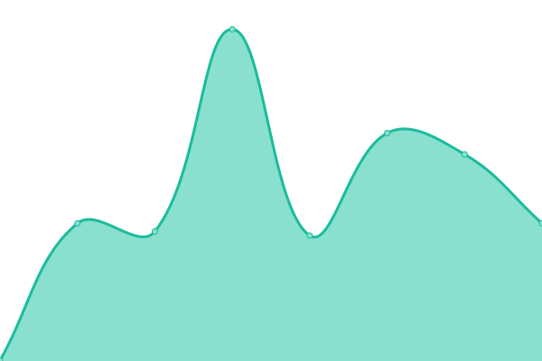

# [📈 Live Status](https://uptime.berty.io): <!--live status--> **🟧 Partial outage**

This repository contains the open-source uptime monitor and status page for [Berty Technologies](https://berty.tech), powered by [Upptime](https://github.com/upptime/upptime).

With [Upptime](https://upptime.js.org), you can get your own unlimited and free uptime monitor and status page, powered entirely by a GitHub repository. We use [Issues](https://github.com/berty/uptime/issues) as incident reports, [Actions](https://github.com/berty/uptime/actions) as uptime monitors, and [Pages](https://uptime.berty.io) for the status page.

<!--start: status pages-->
<!-- This summary is generated by Upptime (https://github.com/upptime/upptime) -->
<!-- Do not edit this manually, your changes will be overwritten -->
<!-- prettier-ignore -->
| URL | Status | History | Response Time | Uptime |
| --- | ------ | ------- | ------------- | ------ |
|  [berty.tech](https://www.berty.tech) | 🟩 Up | [berty-tech.yml](https://github.com/berty/uptime/commits/HEAD/history/berty-tech.yml) | 

 163ms
     
 | 

<a href="https://uptime.berty.io/history/berty-tech">99.94%</a>
    

|  [yolo.berty.io](https://yolo.berty.io/) | 🟩 Up | [yolo-berty-io.yml](https://github.com/berty/uptime/commits/HEAD/history/yolo-berty-io.yml) | 

 336ms
     
 | 

<a href="https://uptime.berty.io/history/yolo-berty-io">100.00%</a>
    

|  [translate.berty.community](https://translate.berty.community) | 🟩 Up | [translate-berty-community.yml](https://github.com/berty/uptime/commits/HEAD/history/translate-berty-community.yml) | 

 251ms
     
 | 

<a href="https://uptime.berty.io/history/translate-berty-community">100.00%</a>
    

|  [vote.berty.community](https://vote.berty.community) | 🟩 Up | [vote-berty-community.yml](https://github.com/berty/uptime/commits/HEAD/history/vote-berty-community.yml) | 

 876ms
     
 | 

<a href="https://uptime.berty.io/history/vote-berty-community">99.90%</a>
    

|  [berty.community](https://berty.community/) | 🟩 Up | [berty-community.yml](https://github.com/berty/uptime/commits/HEAD/history/berty-community.yml) | 

 318ms
     
 | 

<a href="https://uptime.berty.io/history/berty-community">100.00%</a>
    

|  [services.berty.tech](https://services.berty.tech/authorize) | 🟩 Up | [services-berty-tech.yml](https://github.com/berty/uptime/commits/HEAD/history/services-berty-tech.yml) | 

 344ms
     
 | 

<a href="https://uptime.berty.io/history/services-berty-tech">100.00%</a>
    

|  [assets.berty.tech](https://assets.berty.tech/) | 🟩 Up | [assets-berty-tech.yml](https://github.com/berty/uptime/commits/HEAD/history/assets-berty-tech.yml) | 

 141ms
     
 | 

<a href="https://uptime.berty.io/history/assets-berty-tech">100.00%</a>
    

|  [shop.berty.tech](https://shop.berty.tech) | 🟩 Up | [shop-berty-tech.yml](https://github.com/berty/uptime/commits/HEAD/history/shop-berty-tech.yml) | 

 122ms
     
 | 

<a href="https://uptime.berty.io/history/shop-berty-tech">100.00%</a>
    

|  [p2p.paris](https://p2p.paris) | 🟥 Down | [p2p-paris.yml](https://github.com/berty/uptime/commits/HEAD/history/p2p-paris.yml) | 

 508ms
     
 | 

<a href="https://uptime.berty.io/history/p2p-paris">100.00%</a>
    

|  [francep2p.org](https://francep2p.org) | 🟩 Up | [francep2p-org.yml](https://github.com/berty/uptime/commits/HEAD/history/francep2p-org.yml) | 

 206ms
     
 | 

<a href="https://uptime.berty.io/history/francep2p-org">99.94%</a>
    

|  [prom.berty.io](https://prom.berty.io/) | 🟩 Up | [prom-berty-io.yml](https://github.com/berty/uptime/commits/HEAD/history/prom-berty-io.yml) | 

 361ms
     
 | 

<a href="https://uptime.berty.io/history/prom-berty-io">100.00%</a>
    

|  [ssh@svc-fr-1](svc-fr-1.berty.io) | 🟩 Up | [ssh-svc-fr-1.yml](https://github.com/berty/uptime/commits/HEAD/history/ssh-svc-fr-1.yml) | 

 96ms
     
 | 

<a href="https://uptime.berty.io/history/ssh-svc-fr-1">100.00%</a>
    

|  [ssh@svc-ams-1](svc-ams-1.berty.io) | 🟩 Up | [ssh-svc-ams-1.yml](https://github.com/berty/uptime/commits/HEAD/history/ssh-svc-ams-1.yml) | 

 97ms
     
 | 

<a href="https://uptime.berty.io/history/ssh-svc-ams-1">100.00%</a>
    

|  [rdvp@svc-fr-1](51.159.21.214) | 🟩 Up | [rdvp-svc-fr-1.yml](https://github.com/berty/uptime/commits/HEAD/history/rdvp-svc-fr-1.yml) | 

 96ms
     
 | 

<a href="https://uptime.berty.io/history/rdvp-svc-fr-1">100.00%</a>
    

|  [rdvp@svc-ams-1](51.15.25.224) | 🟩 Up | [rdvp-svc-ams-1.yml](https://github.com/berty/uptime/commits/HEAD/history/rdvp-svc-ams-1.yml) | 

 94ms
     
 | 

<a href="https://uptime.berty.io/history/rdvp-svc-ams-1">100.00%</a>
    

<!--end: status pages-->

[**Visit our status website →**](https://uptime.berty.io)

## 📄 License

- Powered by: [Upptime](https://github.com/upptime/upptime)
- Code: [MIT](./LICENSE) © [Berty Technologies](https://berty.tech)
- Data in the `./history` directory: [Open Database License](https://opendatacommons.org/licenses/odbl/1-0/)
